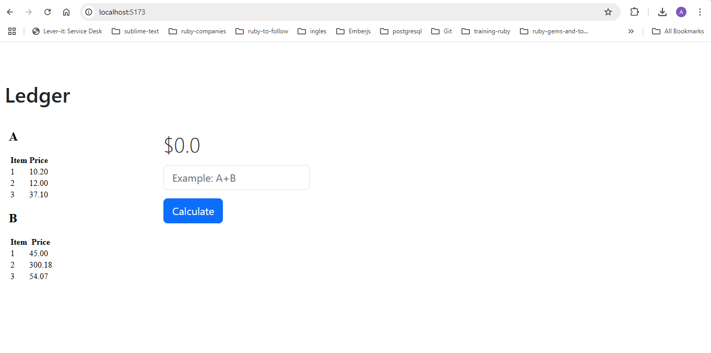

# Project react_calculator_acima
React + Typescript Calculator project, use a backend with a rails api to return a htm base64 document as response to be able to do some mathematic operations(A, B, A+B, A-B, A*B A/B, etc) between two tables A and B in the frontend.

# Project Structure
```bash
react_calculator_acima/
│
├── backend/                  # Rails 7.2.2.1 API
│   └── ...                   # Contains HTML generator and RSpec tests
│
├── frontend/                 # React 18 + TypeScript + Vite + Bootstrap
│   ├── src/
│   │   ├── components/       # UI components (Calculator, HTMLViewer, OperationInput)
│   │   │   └── _tests_/      # Vitest unit tests for components
│   │   ├── interfaces/       # TypeScript interfaces for components
│   │   ├── services/         # Axios service for backend API
│   │   └── utils/            # Logic to parse and compute math operations
│   └── tests/                # Vitest setup for unit tests
│
├── docker-compose.yml        # Orchestrates frontend + backend
└── README.md
```

# To run this project

## 1. Clone the repository and get into the folder
```bash
git clone git@github.com:pollcaz/react_calculator_acima.git
cd react_calculator_acima
```

## 2. You have 2 options: Docker Compose and install the dependencies Locally, the easier one is to use docker-compose in

### 2.1 Using Docker Compose: Build the images and run the containers
```bash
docker-compose up --build
```
### 2.2 Install the dependencies Locally

#### 2.2.1 Backend

 You need to install the dependencies in the backend folder, and first have installed Ruby 3.4.4, Rails 7.2.2.1, and SQLite3
```bash
    bundle install # install the dependencies
    rails s # run the server in port 3000
```
#### 2.2.2 Frontend

You need to install the dependencies in the frontend folder, and first have installed Node 20.19.0 at least
```bash
    npm install # install the dependencies
    npm run dev # run the server in port 5173
```

## 3. open the frontend in your browser and navigate to
 http://localhost:5173


 #### Note#1:  You need to run backend and frontend at the same time before accessing the frontend in your browser the otrherwise the frontend will not be able to connect to the backend and won't display any data.
 #### Note#2: The operations allowed are: A, B, A+B, A-B, A-A, B-B, A * B, B * A, A/B, B/A

# Running tests
## 1. Running Backend tests

### 1.1 Using Docker Compose
```bash
docker-compose run -rm -e RAILS_ENV=test backend bundle exec rspec
```
### 1.2 in local
```bash
cd backend
bundle exec rspec
```
## 2. Running Frontend tests

### 2.1 Using Docker Compose
```bash
docker-compose exec frontend npx vitest run
```
### 2.2 in local
```bash
cd frontend
npx vitest run
```
